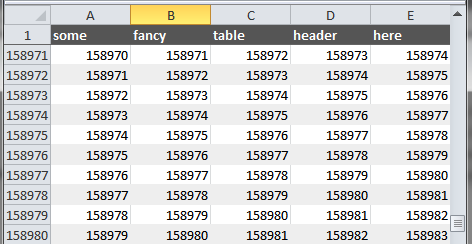

# OneSheet

[](https://scrutinizer-ci.com/g/nimmneun/OneSheet/build-status/master)
[](https://scrutinizer-ci.com/g/nimmneun/OneSheet/?branch=master)

OneSheet is a simple **single sheet** excel/xlsx file writer for php 5.3+



Since performance and memory usage were the main drivers, DOM and SimpleXml
where out of the question. Same goes for cell or even row objects.

This mini library is still WIP and was built to satisfy the following needs:
- Write a single sheet with up to 2^20 rows fast and with a small
  memory footprint.
- Freeze the first [n] rows to have a fixed table header/headline.
- Option to use different fonts, styles and background colors on
  a row level.

Current major drawback(s):
- No cell individualisation, everything is applied at a row level
  and its intended to keep it that way.
- No calculated/formula cells. Only inlineStr and simple number type
  cells and it will probably stay that way.
- No control character escaping todo: RowHelper::addEscapeRow()


```php
<?php require_once '../vendor/autoload.php';

// generate some dummy data
$dataRows = array();
for ($i = 1; $i <= 10000; $i++) {
    $dataRows[] = range($i, $i+4);
}

// memorize timings and memory usage
$t = -microtime(1);
$m = -memory_get_usage(1);

// create new sheet & freeze everything above the 2nd row
$sheet = new \OneSheet\Sheet('A2');

// create new style and add headline using the style
$headerStyle = new \OneSheet\Style();
$sheet->addRow(
    array('some', 'fancy', 'table', 'header', 'here'),
    $headerStyle->bold()->color('FFFFFF')->fill('555555')
);

// add all data rows at once
$sheet->addRows($dataRows);

// create/write the xlsx file ... on close
$writer = new \OneSheet\Writer($sheet, 'somefile.xlsx');
$writer->close();

// echo OneSheet timings und memory usage
echo (microtime(1) + $t) . ' seconds' . PHP_EOL;
echo (memory_get_usage(1) + $m) . ' bytes' . PHP_EOL;
```