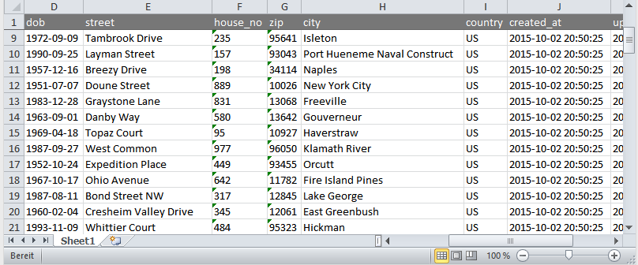

# OneSheet

[](https://travis-ci.org/nimmneun/onesheet)
[](https://scrutinizer-ci.com/g/nimmneun/onesheet/?branch=master)
[](https://scrutinizer-ci.com/g/nimmneun/onesheet/?branch=master)

OneSheet is a simple **single sheet** excel/xlsx file writer for PHP 5.3+ / 7.0+.



This XLSX writer/generator is still WIP and was built to satisfy the following needs:
- Write a single sheet with up to 2^20 rows fast and with a small
  memory footprint.
- Freeze the first [n] rows to have a fixed table header/headline.
- Option to use different fonts, styles and background colors on
  a row level.
- Option to auto-size column widths to fit cell contents
- PHP 5.3 compatibility.

Current major drawback(s):
- No cell individualisation, everything is applied at a row level.
- No calculated/formula cells.

Please be aware that there might be several api breaking changes until version 1.0.0 is released!

###Install
Install via composer
`composer require nimmneun/onesheet`

```php
<?php require_once '../vendor/autoload.php';

// generate some dummy data
$dataRows = array();
for ($i = 1; $i <= 10000; $i++) {
    $dataRows[] = range($i, $i+4);
}

// memorize timings and memory usage
$t = -microtime(1);
$m = -memory_get_usage(1);

// create new sheet & freeze everything above the 2nd row
$oneSheet = new \OneSheet\Writer();
$oneSheet->getSheet()->enableCellAutosizing();

// add all data rows at once
$oneSheet->addRows($dataRows);

// create/write the xlsx file
$oneSheet->writeToFile('somefile.xlsx');

// echo OneSheet timings und memory usage
echo (microtime(1) + $t) . ' seconds' . PHP_EOL;
echo (memory_get_usage(1) + $m) . ' bytes' . PHP_EOL;
```
