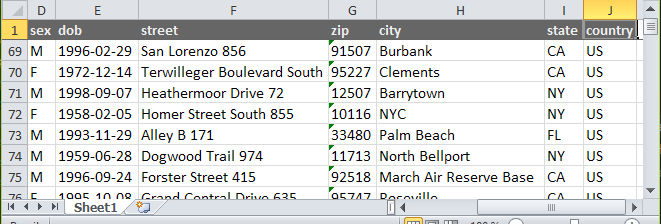

# OneSheet

[](https://travis-ci.org/nimmneun/onesheet)
[](https://scrutinizer-ci.com/g/nimmneun/onesheet/?branch=master)
[](https://scrutinizer-ci.com/g/nimmneun/onesheet/?branch=master)

OneSheet is a simple **single sheet** excel/xlsx file writer for PHP 5.4.4 - 5.6.* and 7.* with cell auto-sizing and styling support.



### What it does
- Write a single sheet fast and with a small memory footprint.
- Freeze the first [n] rows to have a fixed table header/headline.
- Use different fonts, styles, borders and background colors on a row level.
- Set your own custom column width per column.
- Autosize column widths to fit cell contents. If no fonts are found, rough estimates are used.
- Define minimum and maximum column widths to keep exceptionally large or small cell contents in check.

### What it doesnt
- No cell individualisation, everything is applied at a row level.
- No calculated / formula cells.
- No conditional formatting.
- No number formats.
- No charts.

### Install via composer
```
$ composer require nimmneun/onesheet
```

### Manual installation
If you can't or don't want to use composer for some reason,
[download](https://github.com/nimmneun/onesheet/releases/latest) & extract onsheet and require the file autoload.php from the releases root folder.
```php
<?php
// path to onesheet autoload file on your server / webspace e.g.:
require_once '/srv/fancydomain.com/libs/onesheet/autoload.php';
```

### Minimal working example
```php
<?php

require_once '../vendor/autoload.php';

$onesheet = new \OneSheet\Writer('/optional/fonts/directory');
$onesheet->addRow(array('hello', 'world'));
$onesheet->writeToFile('hello_world.xlsx');
```

#### Available Writer operations
```
Writer::setFreezePaneCellId(string cellId)
Writer::setFixedColumnWidths(array columnWidths)
Writer::setColumnWidthLimits(float minWidth, float maxWidth)
Writer::enableCellAutosizing()
Writer::disableCellAutosizing()
Writer::addRows(array rows, style)
Writer::addRow(array row, style)
Writer::writeToFile(string fileName)
Writer::writeToBrowser(string fileName)
```

#### Adding font styles
```
Style::setFontName(string name)
Style::setFontSize(int size)
Style::setFontColor(string color)
Style::setFontBold()
Style::setFontItalic()
Style::setFontUnderline()
Style::setFontStrikethrough()
```
#### Adding background colors (fills)
```
Style::setFillColor(string color)
```

#### Adding borders
```
Style::setSurroundingBorder(style, color)
Style::setBorderLeft(style, color)
Style::setBorderRight(style, color)
Style::setBorderTop(style, color)
Style::setBorderBottom(style, color)
Style::setBorderDiagonalUp(style, color)
Style::setBorderDiagonalDown(style, color)
```

### Cell autosizing
##### ... is cool, but comes with heavy performance impacts - especially when dealing with multibyte characters like ä, ß, Æ, ポ.
Keep in mind though ... you can improve runtimes for larger datasets by disabling it after adding a decent number of rows.

| Impacts of autosizing                 | 100k rows * 10 cols * 5 chars | 100k rows * 10 cols * 10 chars | 100k rows * 10 cols * 20 chars | 100k rows * 10 cols * 40 chars |
| ------------------------------------- | ----------------------------- | ------------------------------ | ------------------------------ | ------------------------------ |
| Autosizing OFF (Single Byte Chars)    | 18 seconds                    | 18 seconds                     | 19 seconds                     | 20 seconds                     |
| Autosizing ON  (Single Byte Chars)    | 23 seconds (+27%)             | 27 seconds (+50%)              | 34 seconds (+78%)              | 49 seconds (+145%)             |
| Autosizing OFF (Multi Byte Chars)     | 20 seconds                    | 21 seconds                     | 23 seconds                     | 26 seconds                     |
| Autosizing ON  (Multi Byte Chars)     | 29 seconds (+45%)             | 36 seconds (+71%)              | 47 seconds (+104%)             | 69 seconds (+126%)             |

### Additional examples
```php
<?php

require_once '../vendor/autoload.php';

// create a header style
$headerStyle = new \OneSheet\Style\Style();
$headerStyle->setFontSize(13)->setFontBold()->setFontColor('FFFFFF')->setFillColor('777777');

// create a data style
$dataStyle1 = new \OneSheet\Style\Style();
$dataStyle1->setFontName('Segoe UI')->setFontSize(10);

// create a second data style
$dataStyle2 = new \OneSheet\Style\Style();
$dataStyle2->setFontName('Arial')->setFillColor('F7F7F7');

// prepare some dummy header data
$dummyHeader = array('Strings', 'Ints', 'Floats', 'Dates', 'Times', 'Uids');

// prepare some dummy data
$dummyData = array();
for ($i = 1; $i <= 100; $i++) {
    $dummyData[] = array(
        substr(md5(microtime()), rand(11,22)),
        rand(333,333333),
        microtime(1),
        date(DATE_RSS, time() + $i*60*60*24),
        date('H:i:s', time() + $i),
        uniqid(null, 1)
    );
}

// create new OneSheet instance
$onesheet = new \OneSheet\Writer();

// add header with style
$onesheet->addRow($dummyHeader, $headerStyle);

// freeze everything above cell A2 (the first row will be frozen)
$onesheet->setFreezePaneCellId('A2');

// enable autosizing of column widths and row heights
$onesheet->enableCellAutosizing();

// add dummy data row by row and switch between styles
foreach ($dummyData as $key=> $data) {
    if ($key % 2) {
        $onesheet->addRow($data, $dataStyle1);
    } else {
        $onesheet->addRow($data, $dataStyle2);
    }
}

// ignore the coming rows for autosizing
$onesheet->disableCellAutosizing();

// add an oversized dummy row
$onesheet->addRow(array('no one cares about my size and I dont even have a special style!'));

// add the all the dummy rows once more, because we can =)
$onesheet->addRows($dummyData);

// Override column widths for columns 6, 7, 8 (column 0 is the first)
$onesheet->setFixedColumnWidths(array(5 => 10, 6 => 10, 7 => 10));

// write everything to the specified file
$onesheet->writeToFile(str_replace('.php', '_onesheet.xlsx', __FILE__));
```

### Playing with colors
```php
<?php

require_once '../vendor/autoload.php';

// initialize and enable cellsizing
$onesheet = new \OneSheet\Writer();
$onesheet->enableCellAutosizing();

// generate dummy data
$data = array_map(function ($x) {
    return str_repeat($x, 10);
}, range(chr(40), chr(120)));

// write data while changing colors
$t = -microtime(1);
for ($i = 0; $i <= 255; $i++) {
    $style = new OneSheet\Style\Style();
    fadeColors($style, 33, 77, $i % 255);
    $onesheet->addRow($data, $style);
}
echo $t + microtime(1) . PHP_EOL;

$onesheet->writeToFile(str_replace('.php', '.xlsx', __FILE__));

function fadeColors(\OneSheet\Style\Style $style, $r = 0, $g = 0, $b = 0) {
    $decHexCss = function ($n) { return sprintf('%02s', dechex($n)); };
    $fontColor = $decHexCss($r) . $decHexCss($g) . $decHexCss($b);
    $fillColor = $decHexCss(255-$r) . $decHexCss(255-$g) . $decHexCss(255-$b);
    $style->setFontColor($fontColor)->setFillColor($fillColor)->setFontSize(9);
}
```

### Issues, bugs, features and ...
Feel free to report any sightings =).
